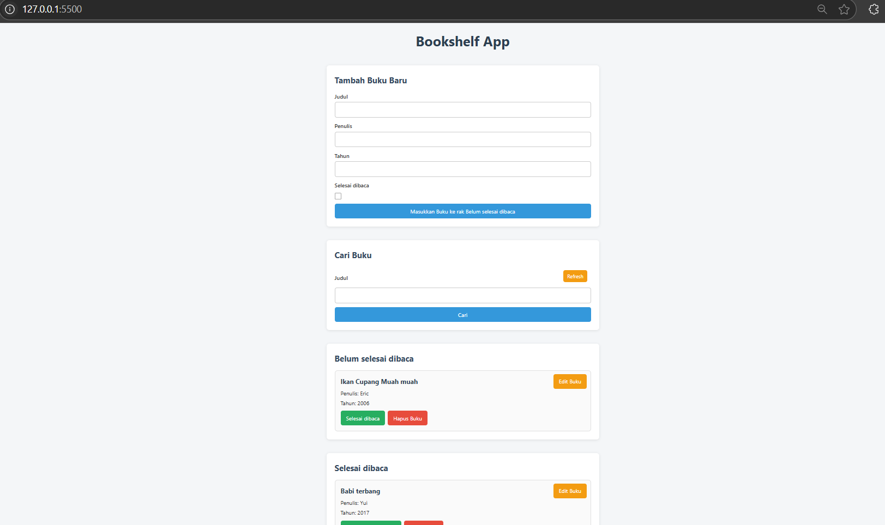
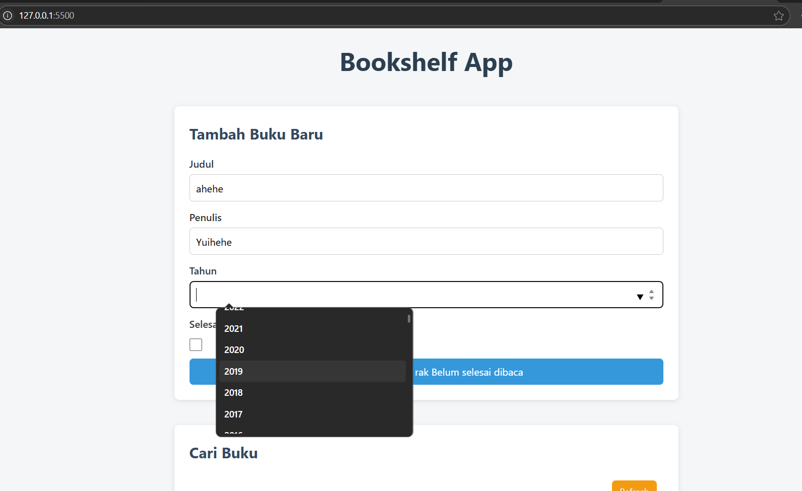

# 📚 Bookshelf App

A simple bookshelf web application created using **HTML**, **CSS**, and **JavaScript (vanilla)**. This project allows users to manage their personal book collection — adding, searching, editing, categorizing, and removing books — all stored in the browser's local storage.

---

## 📷 Preview




---

## 🚀 Features

- 📥 **Add Book**  
  Input the book title, author, year, and whether the book has been read or not.

- 🔍 **Search Book**  
  Search for books by title using a case-insensitive search bar.

- ✅ **Mark as Completed / Uncompleted**  
  Toggle book status between "Finished Reading" and "Not Finished".

- ✏️ **Edit Book**  
  Prompt a dialog to update the title, author, and year.

- ❌ **Delete Book**  
  Instantly remove a book from your shelf.

- 💾 **Persistent Storage**  
  All book data is saved using `localStorage`, so it stays even after you close the browser.

- 🔄 **Refresh Search**  
  Reset search input to show all books again.

- 📅 **Year Picker**  
  Automatically generate a list of years from 1950 to the current year for user convenience.

---

## 🧱 Tech Stack

- HTML
- CSS
- JavaScript (Vanilla)
- LocalStorage API

---

## 🗂 Folder Structure

 ```bash
   📁 bookshelf-app/
├── index.html # Main HTML page
├── main.js # Application logic
├── style.css # Styling file
├── README.md # Project documentation
   ```

## 🛠 How to Use

1. Clone or download the repository.
2. Open `index.html` with any browser.
3. Enjoy your personal digital bookshelf!

---
